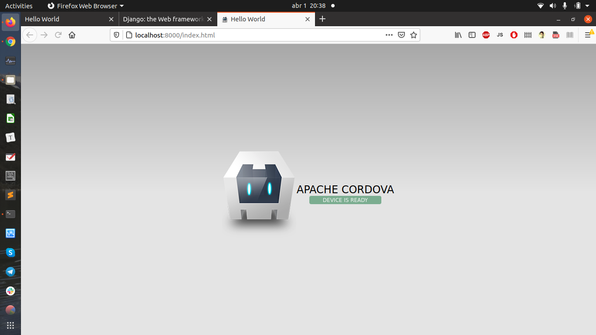

# myCordoba
This is my repo for studying Apache Cordova. My goal is to build a mobile app using HTML, Javascript and CSS for Android amd iOS phones.

Check Java:
```bash
java -version
```
If the Java version is not 8 (@Ubuntu 20), then we need to remove and install java 8 with:
```bash
sudo rm -r /usr/lib/jvm/java-11-......
sudo apt install openjdk8-jdk openjdk-8-jre
java -version
```
After installing Java, Android SDK, Node, and maybe sth else:

```bash
export PATH=/home/charlieromano/Documents/Personal/Arch/myCordoba/hello
## This is the local path for the app

export ANDROID_SDK_ROOT=/home/charlieromano/Android/Sdk
export ANDROID_HOME=/home/charlieromano/Android/Sdk
export JAVA_HOME=/usr/lib/jvm/java-8-openjdk-amd64

cd $PATH
yes | sdkmanager --licenses --sdk_root=$ANDROID_HOME
cordova run
```


